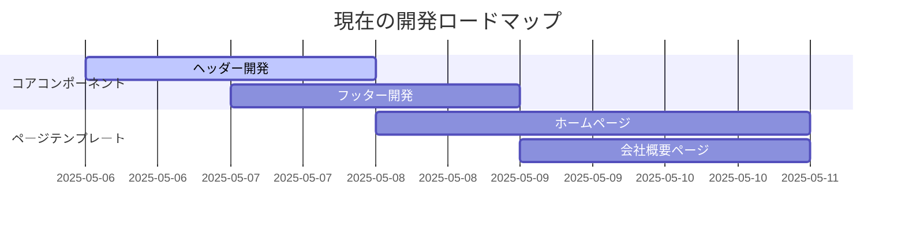

# 現在の作業コンテキスト

## 現在の焦点
- 企業向けWebサイトの基本構造構築
- 共通コンポーネント開発
- 初期ページテンプレート作成

## 直近の変更
1. プロジェクト設計文書作成
   - projectbrief.md
   - productContext.md
   - systemPatterns.md
   - techContext.md

2. 基本技術スタック確定
   - Next.js + TypeScript
   - CSS Modules

## 進行中のタスク

## 決定事項
- Atomic Design採用
- モバイルファーストアプローチ
- アクセシビリティ準拠必須
