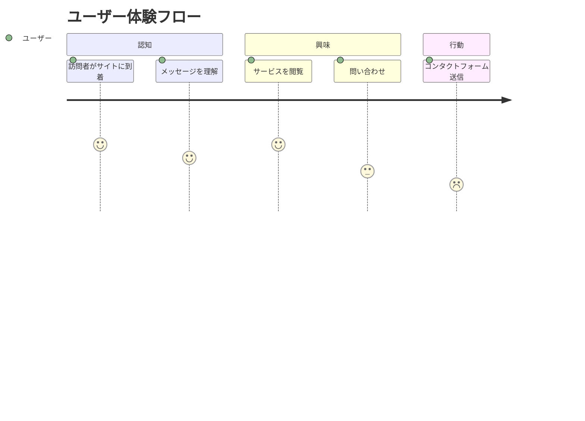

# プロダクトコンテキスト

## ビジネス目標
- 企業ブランド認知度の向上
- リードジェネレーションの促進
- 顧客エンゲージメントの強化

## ユーザーストーリー

## 主要ページ要件
1. ホームページ:
   - 企業の価値提案を明確に表示
   - 主要サービス/製品のハイライト
   - 明確なCTA (Call to Action)

2. 会社概要:
   - 企業理念と沿革
   - 経営陣紹介
   - 事業所情報

3. サービスページ:
   - サービス詳細
   - 事例紹介
   - 技術仕様 (必要に応じて)

## 成功指標
- 問い合わせフォーム送信数
- 平均セッション時間
- 主要ページの離脱率
