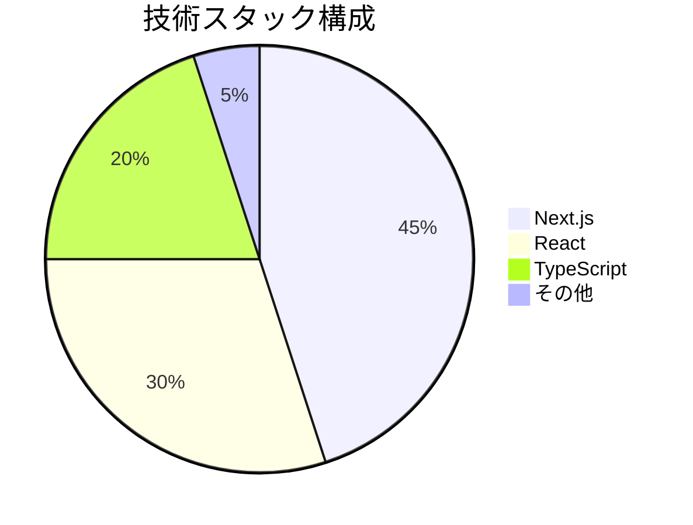

# 技術コンテキスト

## コア技術スタック

## 開発環境
- Node.js: v18+
- パッケージマネージャー: npm
- IDE: VSCode推奨
- 必須拡張機能:
  - ESLint
  - Prettier
  - TypeScript拡張

## 依存関係
1. 主要ライブラリ:
   - next: フレームワークコア
   - react-dom: クライアントレンダリング
   - swr: データフェッチ

2. 開発依存:
   - @typesパッケージ群
   - testing-library
   - eslintプラグイン

## ビルド＆デプロイ
- ビルドコマンド: `npm run build`
- 出力ディレクトリ: /out
- 推奨ホスティング: Vercel
- CI/CD: GitHub Actions
